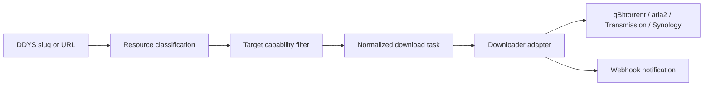

# Architecture

`ddys-download-bridge` is split into four layers.

1. DDYS client: reads search, latest, hot, detail, and source resources from the DDYS API.
2. Resource planner: classifies links as magnet, torrent, direct media, HTTP, ed2k, cloud, or unsupported.
3. Download adapters: map one normalized task into qBittorrent, aria2, Transmission, or Synology Download Station calls.
4. CLI and HTTP API: expose the same bridge actions for scripts and local integrations.

The bridge does not download files itself. It only validates, classifies, and submits tasks to a configured downloader.

## Task Flow

## Supported Resource Types

| Type | aria2 | qBittorrent | Transmission | Synology |
| --- | --- | --- | --- | --- |
| magnet | yes | yes | yes | yes |
| torrent URL | yes | yes | yes | yes |
| HTTP/HTTPS | yes | no | no | yes |
| direct media URL | yes | no | no | yes |
| ed2k | yes | no | no | yes |
| cloud drive share | no | no | no | no |

Cloud drive links are shown to the caller but skipped by default because they usually need a separate account, cookie, or transfer workflow.
